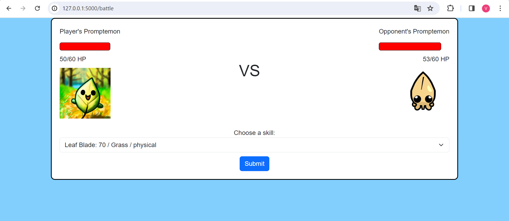
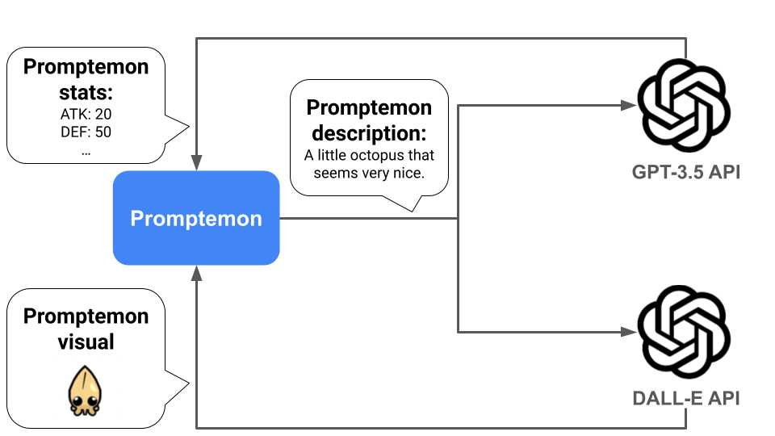

# Promptemon

Promptemon is a little game in which you can imagine Promptemons and with the magic of OpenAI APIs, you will be able to engage in battles with them!



## Installation

Use the package manager [pip](https://pip.pypa.io/en/stable/) to install promptemon's dependancies.

```bash
pip install -r requirements.txt
```

Alternatively you can use [poetry](https://python-poetry.org/).

## Usage

Run the server and the game will start in your preferred browser:

```bash
python server.py
```

## How it works

When starting the game you are asked to describe your imaginary Promptemon. Once you're done, your description is sent to the OpenAI API (the default model used is gpt-3.5-turbo), along with the instruction to imagine the stats (atk, def, hp, ...) of the Promptemon you described. 
Finally, your description is also sent to Dall-e (through the OpenAI API again), with the task of imagining what the Promptemon you described looks like!

